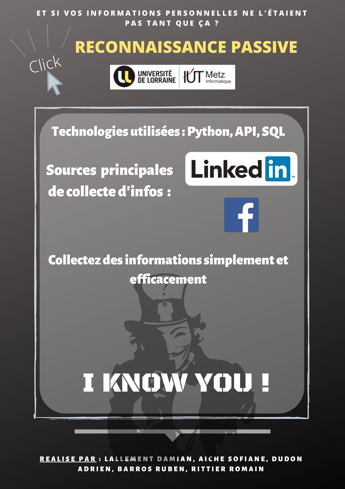

# Linkedin Scraper

This software is a data scraping tool that can extract company employees data from LinkedIn and from the Crunchbase API, then store those in a MySQL Database.

## Description

College project carried out in partnership with the Excellium Services company (Which is a security consultant company). The goal was to create a tool which automatically and quickly retrieve information about people working in a company. Our group and project was in competition with other project, and we have been voted among the best.

## Issues

Because this tool has not been updated since its creation in 2019, the current code base needs some changes to work. (Because of change in the LinkedIn DOM and Crunchbase API). Unfortunately, I can't update it myself as I have to work on others projects for my studies. But you can use my code to inspire your own projects. Feel free to contact me if you have any questions.

## More Information and Awards

If you are want more information about this project, we made a full report, a powerpoint presentation and a poster (all in french) that you can find below:
* Full report: https://drive.google.com/file/d/1FeTMLECHhs80hcg7O5SwOqT4uSmyz29_/view?usp=sharing
* Presentation (powerpoint): https://drive.google.com/file/d/14-nfXqS4cAnA17mJTNMoPxFUXW6Da-2Q/view?usp=sharing

(If the links are dead, feel free to contact me)

**Poster:**

## Languages and technologies

Python, MySQL, API Crunchbase, Selenium

## Authors

### Project Leader (management) :

Damian Lallement

### Data scraping bot : 

Adrien Dudon (Me)

### Database : 

Damian Lallement.

### GUI :

Romain Rittier, Sofiane Aiche.

---
